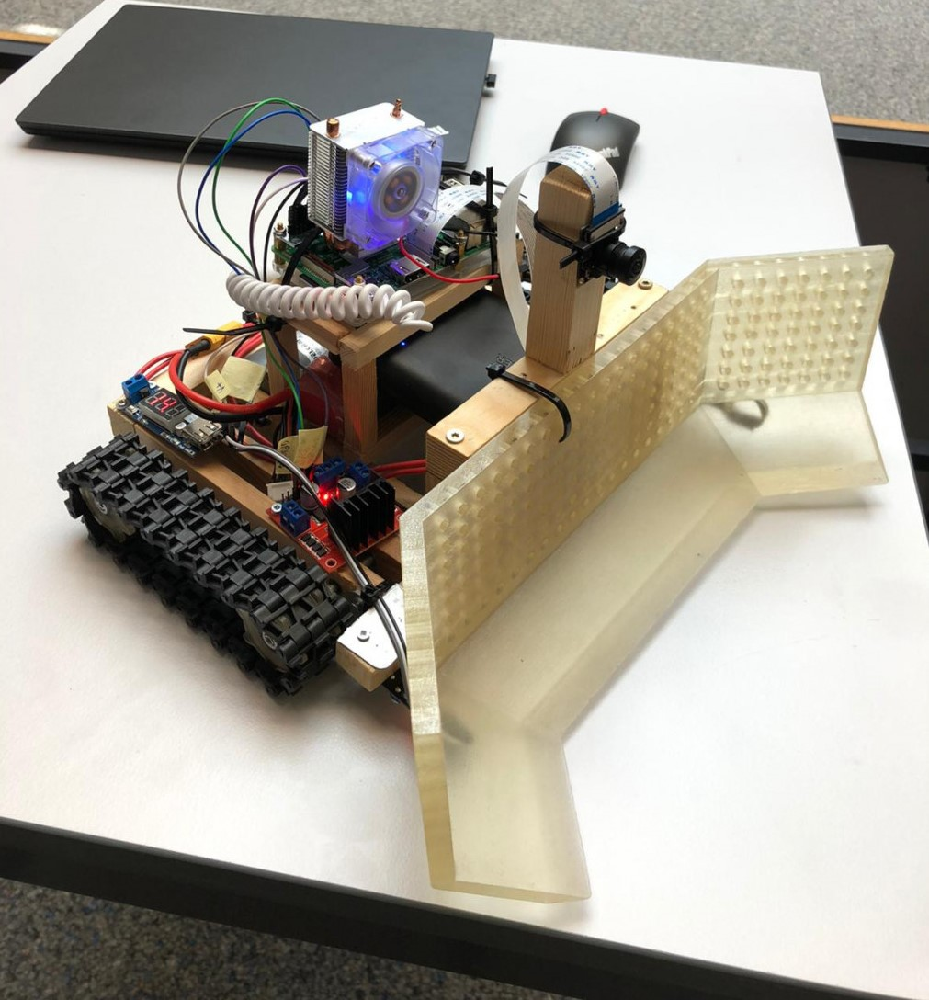

# dhbw-vs-irobot-firmware

🤖 The firmware of the "iRobot" robot.

## Recordings 📷

 

## Development Setup 💻

### Local development

1. Install [Docker](https://docs.docker.com/get-docker/).
2. Install [VSCode](https://code.visualstudio.com/) with the [VSCode Remote Development Extension Pack](https://marketplace.visualstudio.com/items?itemName=ms-vscode-remote.vscode-remote-extensionpack).
3. Clone this repository:
    ```
    git clone https://github.com/robingenz/dhbw-vs-irobot-firmware.git
    ```
4. Open the repository with [VSCode Remote-Containers](https://code.visualstudio.com/docs/remote/containers).

### Remote development on Raspberry Pi

1. Install [VSCode](https://code.visualstudio.com/) with the [VSCode Remote Development Extension Pack](https://marketplace.visualstudio.com/items?itemName=ms-vscode-remote.vscode-remote-extensionpack).
2. Connect to your Raspberry Pi using [VSCode Remote - SSH](https://code.visualstudio.com/docs/remote/ssh).
3. Clone this repository:
    ```
    git clone https://github.com/robingenz/dhbw-vs-irobot-firmware.git
    ```
